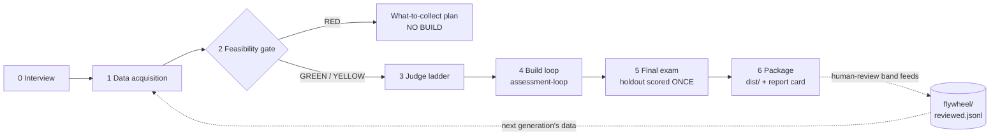

# Engine-factory pipeline — stage contracts

The end-to-end flow that turns "I need a grader for X" into a certified,
packaged writing assessment engine. The orchestration lives in
`.claude/skills/engine-factory/SKILL.md`; the proven inner loop is
`.claude/skills/assessment-loop/`. This document is the stage-contract spec:
what each stage consumes, produces, and is allowed to decide.

| #   | Stage            | Consumes                          | Produces                                                                       | Decides                                                    |
| --- | ---------------- | --------------------------------- | ------------------------------------------------------------------------------ | ---------------------------------------------------------- |
| 0   | Interview        | user conversation                 | `spec.json`                                                                    | nothing (records)                                          |
| 1   | Data acquisition | spec + user files and/or web hunt | `corpus.jsonl`, `provenance.md`, `data-audit.json`, reserved exemplars         | nothing (records)                                          |
| 2   | Feasibility gate | data-audit + spec.stakes          | `feasibility-report.md`                                                        | **GO / DEGRADED / NO-GO** — the user confirms before spend |
| 3   | Judge ladder     | train split only                  | `judge-selection.md` (per-trait model table)                                   | judge mix                                                  |
| 4   | Build loop       | scaffold + judge mix              | kept engine (git tag `best`), `experiments.jsonl`, learnings                   | keep/discard per iteration (CI-LB + floors)                |
| 5   | Final exam       | sealed holdout                    | `RESULTS.md` (holdout spent)                                                   | certification numbers                                      |
| 6   | Package          | best engine + RESULTS             | `dist/<task>/` (engine, grade.sh, REPORT-CARD.md, report-card.json, flywheel/) | claim tier wording                                         |

## Design decisions (and the measurements behind them)

1. **Feasibility gate before any spend.** N was the binding constraint in
   every measured run (39/split → CI half-widths ±0.10–0.15). The gate's
   thresholds (120+ examples, all score points, ≥4 lowest-class exemplars,
   rationales present) are the empirical minimums below which claims stop
   meaning anything. RED means refuse-and-explain, not try-anyway.
2. **Bring-your-own-data is the primary path.** The web sweep for extra
   STAAR data (2026-07-18) found exactly one additional usable document —
   public scored exemplars are rare. Web hunt is a bonus, not the plan.
3. **Judge ladder is per-task and mandatory.** Measured: gpt-5.4 (strongest
   reasoning model tried) was the worst rubric judge; a gpt-4.1 + gpt-4o
   trait mix was the first config to pass both trait floors. Model choice
   does not transfer between tasks or languages on assumption.
4. **The inner loop is unchanged.** assessment-loop's harness rules
   (fresh builders, chmod-locked secret, CI-LB multi-objective keep,
   multi-floor stop, holdout-once) are validated across four runs and two
   grade bands; the factory configures it, it does not fork it. Gen-4
   anti-gaming settings (top-k diagnostics, rounded aggregates, cleared
   out/) are applied by the factory at scaffold time.
5. **The human-review band is a feature with a data model.** Engines are
   weakest at graded-quality boundaries (1/2, 2/3) — every run shows it,
   and the three-gate falsification showed another adjudicator can't fix
   it. So the package routes exactly those calls to a human, and each human
   correction lands in `flywheel/reviewed.jsonl` — which is next
   generation's training data. Weakness → review band → new gold → gen+1.
6. **Report card mirrors the evidence gates.** `report-card.json` carries
   RED/YELLOW/GREEN so the writing-engine heartbeat can enforce
   don't-use-beyond-evidence at runtime, same as every other domain.

## Known gaps (deliberately not hidden)

- Builders are tripwired (chmod + transcript audit), not sandboxed —
  containerization is the hardening step for adversarial settings.
- No meta-loop yet: next-change selection inside the loop is builder
  intuition; a GEPA-style optimizer is the named upgrade.
- Dollar cost per iteration is printed but not yet budgeted/capped
  automatically.
- No measured evidence yet outside the STAAR ECR family (Spanish and
  English, grades 3–10, are now covered — see Live results); the pipeline
  is designed to acquire evidence per task, never to assume transfer.

## Live results (as of 2026-07-23)

Four task families built and certified by this pipeline, all sealed
first-exposure exams, total-QWK claims at the 95% CI lower bound:

| family                | holdout exam                                   | notes                                                                         |
| --------------------- | ---------------------------------------------- | ----------------------------------------------------------------------------- |
| English 3–5           | 0.880 [LB 0.791] (N=39)                        | original loop run                                                             |
| English 6–8           | 0.869 [LB 0.643] (N=12)                        | gen-3; zero adjudicator independently converged on responsiveness criteria    |
| Spanish 3–5 gen-1     | 0.906 [LB 0.773] (N=13)                        | first non-English build, one session end-to-end                               |
| **Spanish 3–5 gen-2** | **0.872 [LB 0.767] (N=39, 2/3 argumentative)** | head-to-head vs gen-1: total tie, **false zeros 2→0**, Ideas +0.047 — adopted |
| English I/II HS       | 0.859 [LB 0.702] (N=26, true fresh year)       | zeros 4/4 @ precision 1.0                                                     |

Adaptability mechanism, measured: the gen-2 lessons were adopted for
Spanish (own sealed exam), REJECTED for both English elementary/middle
engines by paired dev evals (one significantly negative), deferred for
high school (circular provenance). Engines specialize per test; the
factory carries general knowledge; tools/regression-gate/ gates every
shared-layer candidate per family.
